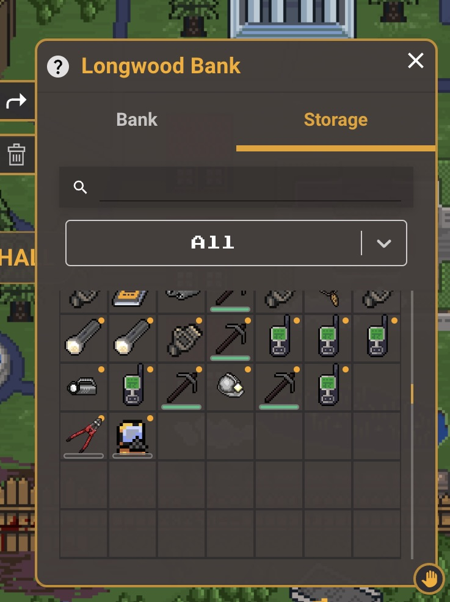
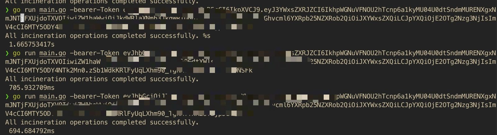

An easy way of getting all your items with 0 durability deleted from the Remnant Game

### Check out the Game

- [Remnant Game](https://game.theremnants.app/)

### Install Go

- [Golang Installation](https://go.dev/doc/install)

### Make sure you have all your items in the bank storage

### Get your bearer-Token also cause it is needed for authorization and it is unique to you personally. DONT SHARE IT!
[Bearer Token](https://www.youtube.com/watch?v=ky7syfzGX2E)

### Clone the repostiory

### Run `go run main.go -bearer-Token YOURBEARERTOKEN`

